# Benchmarks
Benchmarks were acquired using [JMH](https://github.com/openjdk/jmh) and
[jmh-clojure](https://github.com/jgpc42/jmh-clojure/).

Each test is for a single call to:

```
(org.openjdk.jmh.infra.Blackhole/consumeCPU 100)
```

This consumes 100 "time tokens" and care is taken to keep it from getting optimized
out by the JIT. Each benchmark contains a "Baseline" measurement which is just
the call to `(Blackhole/consumeCPU 100)` with no other calls.

Each test includes a "serial" run with one thread and a "parallel" run with 8
threads. The intention is to test the overhead Fusebox brings to applications, and thus
each test is designed for threads to not have to block on Fusebox machinery (i.e.
the optimal throughput case). For example, [bulkhead](#bulkhead) is set to allow
25 threads so there is never contention to enter the bulkhead. This seems
counterintuitive, but otherwise you end up measuring the latency of the operation
under test (in this case `Blackhole/consumeCPU`).

Big shoutout to @jgpc42. If it weren't for his work on jmh-clojure, testing with
JMH would have taken weeks instead of hours.

Charts were generated using [clj-xchart](https://hypirion.github.io/clj-xchart/).

## Table of Contents
* [Settings](#settings)
* [Bulkhead](#bulkhead)
* [Circuit Breaker](#circuit-breaker)
* [Fallback](#fallback)
* [Memoize](#memoize)
* [Rate Limit](#rate-limit)
* [Retry](#retry)
* [Timeout](#timeout)

#### Settings
All tests were performed on a 14-inch, 2021 MacBook Pro:
* Apple M1 Max
  * 8 performance cores
  * 2 efficiency cores
* 32 GB
* Sonoma 14.5

##### Normal
```
# JMH version: 1.32
# VM version: JDK 21.0.4, OpenJDK 64-Bit Server VM, 21.0.4
# VM invoker: /opt/homebrew/Cellar/openjdk@21/21.0.4/libexec/openjdk.jdk/Contents/Home/bin/java
# VM options: -XX:-OmitStackTraceInFastThrow -Dfusebox.usePlatformThreads=false -Dlogback.configurationFile=logback-dev.xml -Dclojure.basis=.cpcache/3045479295.basis
# Blackhole mode: full + dont-inline hint
# Warmup: 5 iterations, 10 s each
# Measurement: 5 iterations, 10 s each
# Timeout: 10 min per iteration
# Threads: 1 thread, will synchronize iterations
# Benchmark mode: Sampling time
```
##### Direct Linking
```
# JMH version: 1.32
# VM version: JDK 21.0.4, OpenJDK 64-Bit Server VM, 21.0.4
# VM invoker: /opt/homebrew/Cellar/openjdk@21/21.0.4/libexec/openjdk.jdk/Contents/Home/bin/java
# VM options: -XX:-OmitStackTraceInFastThrow -Dfusebox.usePlatformThreads=false -Dlogback.configurationFile=logback-dev.xml -Dclojure.basis=.cpcache/3045479295.basis -Dclojure.compiler.direct-linking=true
# Blackhole mode: full + dont-inline hint
# Warmup: 5 iterations, 10 s each
# Measurement: 5 iterations, 10 s each
# Timeout: 10 min per iteration
# Threads: 1 thread, will synchronize iterations
# Benchmark mode: Sampling time
```

## bulkhead
This test was done with the (default) Resilience4J SemaphoreBulkhead. Fusebox also
uses a semaphore for its bulkhead, and, as expected, the timings are very similar.

When using direct linking, Fusebox even slightly outperforms Resilience4J — likely
due to having fewer layers of wrapping code.

### Normal
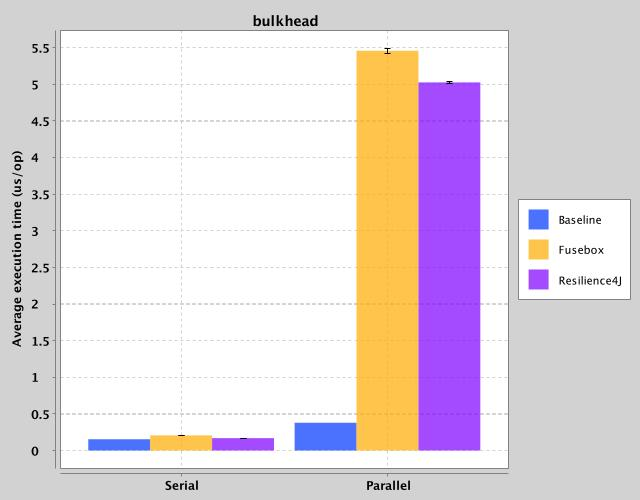

|Test|Baseline (um)|Avg. Execution Time (um)|Approx. Overhead (um)|Error (um)|
|---|---|---|---|---|
|Fusebox|0.154582|0.205896|0.051314|0.002354|
|Resilience4J|0.154582|0.169267|0.014685|0.001536|
|Fusebox (Parallel)|0.379682|5.457751|5.078069|0.031275|
|Resilience4J (Parallel)|0.379682|5.025730|4.646048|0.009122|

### Direct Linking
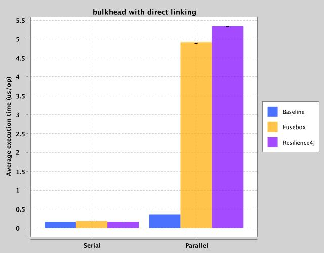

|Test|Baseline (um)|Avg. Execution Time (um)|Approx. Overhead (um)|Error (um)|
|---|---|---|---|---|
|Fusebox|0.166132|0.186927|0.020795|0.001494|
|Resilience4J|0.166132|0.167206|0.001074|0.001602|
|Fusebox (Parallel)|0.364068|4.919228|4.555160|0.027115|
|Resilience4J (Parallel)|0.364068|5.338609|4.974541|0.012748|

## circuit-breaker
Circuit breaker was by far the most difficult utility to get right. Every other
utility is more or less a wrapper on some `java.util.concurrent` class. Circuit
breaker, on the other hand, is a novel clojure implementation. (Retry is also
a novel re-write, but it's trivial to write.)

With that introduction, I'm very pleased with the results. With direct linking,
Fusebox is within 20% of the overhead of Resilience4J for the most common use case,
and is sub-microsecond for the single-threaded use case.

### Normal
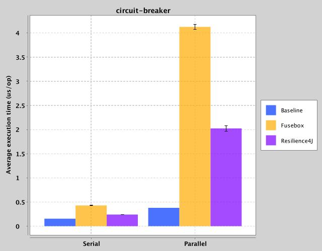

|Test|Baseline (um)|Avg. Execution Time (um)|Approx. Overhead (um)|Error (um)|
|---|---|---|---|---|
|Fusebox|0.154582|0.428699|0.274117|0.005565|
|Resilience4J|0.154582|0.241235|0.086653|0.003138|
|Fusebox (Parallel)|0.379682|4.128195|3.748513|0.052430|
|Resilience4J (Parallel)|0.379682|2.025333|1.645651|0.057266|

### Direct Linking
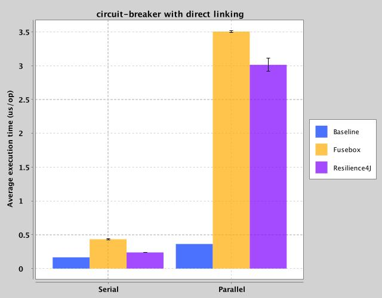

|Test|Baseline (um)|Avg. Execution Time (um)|Approx. Overhead (um)|Error (um)|
|---|---|---|---|---|
|Fusebox|0.166132|0.433742|0.267610|0.008181|
|Resilience4J|0.166132|0.239193|0.073061|0.001793|
|Fusebox (Parallel)|0.364068|3.504339|3.140271|0.017391|
|Resilience4J (Parallel)|0.364068|3.013410|2.649342|0.097159|

## fallback
Not much to say here. You're seeing the cost of adding a try/catch to a call.

### Normal
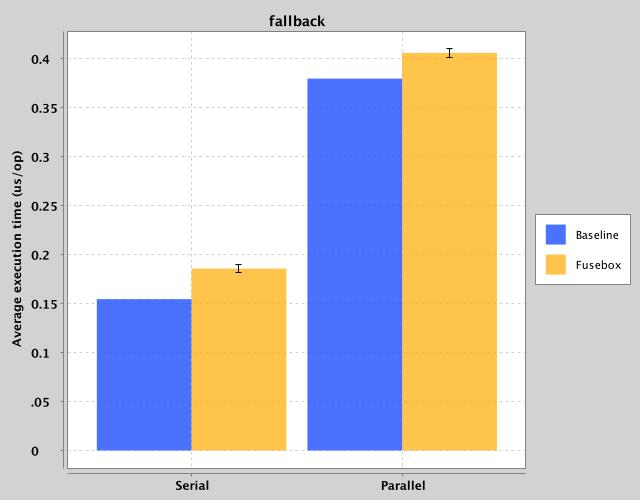

|Test|Baseline (um)|Avg. Execution Time (um)|Approx. Overhead (um)|Error (um)|
|---|---|---|---|---|
|Fusebox|0.154582|0.185696|0.031114|0.004278|
|Fusebox (Parallel)|0.379682|0.405983|0.026301|0.004382|

### Direct Linking
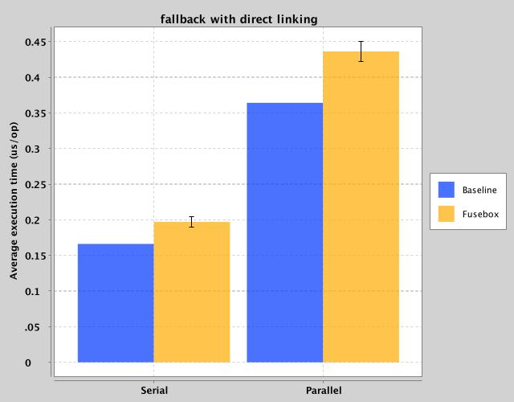

|Test|Baseline (um)|Avg. Execution Time (um)|Approx. Overhead (um)|Error (um)|
|---|---|---|---|---|
|Fusebox|0.166132|0.196984|0.030852|0.007702|
|Fusebox (Parallel)|0.364068|0.436153|0.072085|0.014492|

## memoize
Memoize was tricky to do, and in some ways this test is useless. Ideally, it
would have included a call to `(Blackhole/consumeCPU 100)` for every invocation,
however to do so it would need a unique string value for every invocation. JMH
makes it [very clear](https://github.com/openjdk/jmh/blob/master/jmh-core/src/main/java/org/openjdk/jmh/annotations/Level.java#L49-L84)
that you shouldn't expect invocation-level fixtures to work well in the sub-millisecond
range, so we're left more or less measuring the lookup speed to `ConcurrentHashMap`.

### Normal
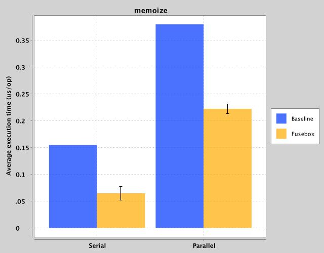

|Test|Baseline (um)|Avg. Execution Time (um)|Approx. Overhead (um)|Error (um)|
|---|---|---|---|---|
|Fusebox|0.154582|0.064681|-0.089901|0.012942|
|Fusebox (Parallel)|0.379682|0.222143|-0.157539|0.008690|

### Direct Linking
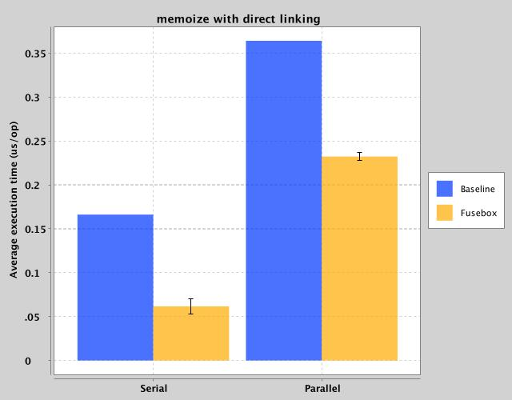

|Test|Baseline (um)|Avg. Execution Time (um)|Approx. Overhead (um)|Error (um)|
|---|---|---|---|---|
|Fusebox|0.166132|0.061700|-0.104432|0.008526|
|Fusebox (Parallel)|0.364068|0.232351|-0.131717|0.004692|

## rate-limit
The Rate Limit benchmark uses the (non-default) `SemaphoreBasedRateLimiter` for
the Resilience4J test. The maintainer of Resilience4J says [it is the highest
throughput rate limiter](https://medium.com/@storozhuk.b.m/rate-limiter-internals-in-resilience4j-48776e433b90)
they have, and it's the implementation Fusebox uses. Fusebox out-performs in the
parallel benchmark, and my suspicion is it's because Resilience4J sets the
[fairness parameter](https://docs.oracle.com/javase/8/docs/api/java/util/concurrent/Semaphore.html)
to `true` for their rate limiter.

These benchmarks were done with the following settings:

* Bucket Size (limit per period): 1000000
* Period (limit refresh period): 1 ms

As stated in the introduction, the goal was for the rate limiter to never actually
limit execution, and 1ns/execution was two orders of magnitude below baseline
execution time.

### Normal
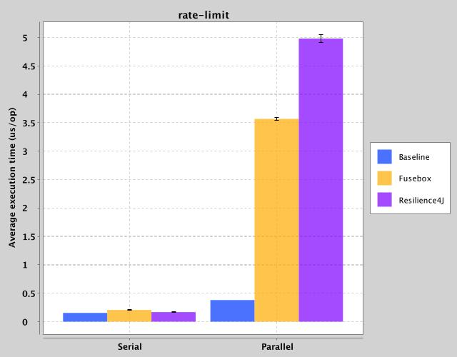

|Test|Baseline|Avg. Execution Time|Approx. Overhead|Error|
|---|---|---|---|---|
|Fusebox|0.154582|0.205702|0.051120|0.003154|
|Resilience4J|0.154582|0.168028|0.013446|0.001828|
|Fusebox (Parallel)|0.379682|3.567776|3.188094|0.025402|
|Resilience4J (Parallel)|0.379682|4.980704|4.601022|0.069383|

### Direct Linking
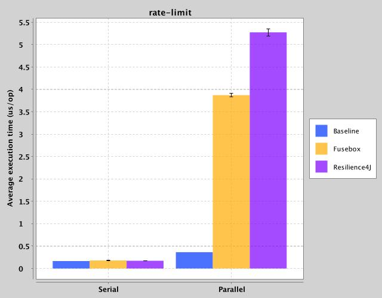

|Test|Baseline|Avg. Execution Time|Approx. Overhead|Error|
|---|---|---|---|---|
|Fusebox|0.166132|0.180684|0.014552|0.005332|
|Resilience4J|0.166132|0.173372|0.007240|0.004391|
|Fusebox (Parallel)|0.364068|3.871150|3.507082|0.042465|
|Resilience4J (Parallel)|0.364068|5.274653|4.910585|0.076962|

## retry
It's not terribly surprising that Resilience4J outperforms Fusebox for serial
execution. However, I was somewhat surprised to see a speed boost from Fusebox
for parallel execution. My guess is that this is due to Resilience4J using shared
`LongAddr`s to track successes and failures across all threads.

### Normal
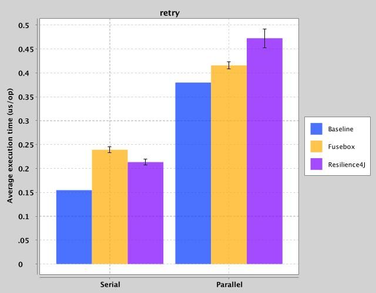

|Test|Baseline|Avg. Execution Time|Approx. Overhead|Error|
|---|---|---|---|---|
|Fusebox|0.154582|0.239182|0.084600|0.005606|
|Resilience4J|0.154582|0.213350|0.058768|0.006528|
|Fusebox (Parallel)|0.379682|0.415811|0.036129|0.007256|
|Resilience4J (Parallel)|0.379682|0.472425|0.092743|0.019795|


### Direct Linking
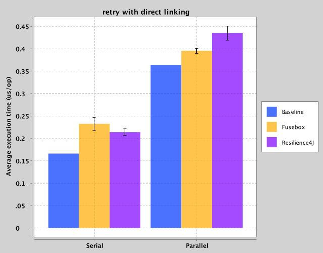

|Test|Baseline|Avg. Execution Time|Approx. Overhead|Error|
|---|---|---|---|---|
|Fusebox|0.166132|0.232528|0.066396|0.013922|
|Resilience4J|0.166132|0.214029|0.047897|0.007438|
|Fusebox (Parallel)|0.364068|0.395392|0.031324|0.005156|
|Resilience4J (Parallel)|0.364068|0.435438|0.071370|0.015799|

## timeout
Like bulkhead, timeout is more or less implemented the same in Fusebox and Resilience4J.
Unsurprisingly, the numbers are basically identical, particularly once direct
linking is turned on.

### Normal
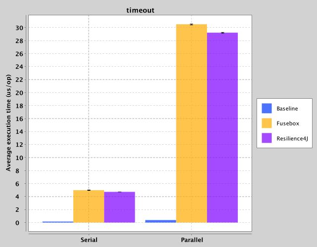

|Test|Baseline (um)|Avg. Execution Time (um)|Approx. Overhead (um)|Error (um)|
|---|---|---|---|---|
|Fusebox|0.154582|4.982839|4.828257|0.026509|
|Resilience4J|0.154582|4.718003|4.563421|0.022608|
|Fusebox (Parallel)|0.379682|30.508554|30.128872|0.077493|
|Resilience4J (Parallel)|0.379682|29.219341|28.839659|0.075773|

### Direct Linking
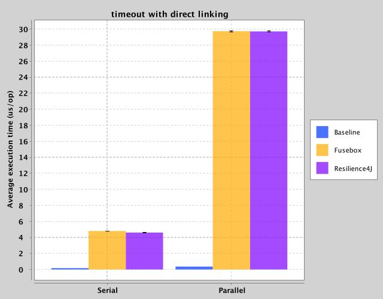

|Test|Baseline (um)|Avg. Execution Time (um)|Approx. Overhead (um)|Error (um)|
|---|---|---|---|---|
|Fusebox|0.166132|4.806129|4.639997|0.011052|
|Resilience4J|0.166132|4.607709|4.441577|0.011537|
|Fusebox (Parallel)|0.364068|29.743588|29.379520|0.078046|
|Resilience4J (Parallel)|0.364068|29.715175|29.351107|0.060138|
